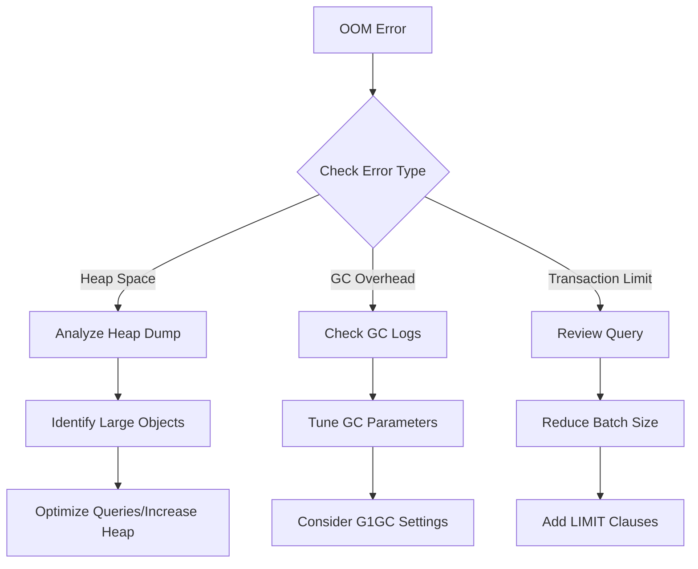

# Neo4j Memory Forensics Guide

> **Critical**: Neo4j uses THREE distinct memory regions that can independently cause OutOfMemoryError. This guide helps prevent catastrophic memory failures based on lessons from production incidents.

## Executive Summary

Neo4j's JVM-based architecture requires careful memory management across:
1. **Heap Memory** - Java objects and query execution
2. **Page Cache** - Database file caching
3. **Transaction Memory** - Query state and buffers

Unlike FalkorDB's single-buffer explosion (7,762x incident), Neo4j failures are often more subtle and involve interaction between these three regions.

---

## Table of Contents
1. [Memory Architecture](#memory-architecture)
2. [Early Warning Signs](#early-warning-signs)
3. [Configuration Guidelines](#configuration-guidelines)
4. [Graphiti-Specific Considerations](#graphiti-specific-considerations)
5. [Monitoring Commands](#monitoring-commands)
6. [Troubleshooting OOM](#troubleshooting-oom)
7. [Prevention Strategies](#prevention-strategies)

---

## Memory Architecture

### 1. Heap Memory (JVM Heap)
```yaml
# Configuration in docker-compose.yml
NEO4J_server_memory_heap_initial__size: 4g
NEO4J_server_memory_heap_max__size: 4g
```

**Used for:**
- Cypher query execution
- Transaction state before commit
- Caching query plans
- Network buffers

**Failure mode:** `java.lang.OutOfMemoryError: Java heap space`

### 2. Page Cache (Off-Heap)
```yaml
NEO4J_server_memory_pagecache_size: 8g
```

**Used for:**
- Caching database files in memory
- Index structures
- Relationship chains

**Failure mode:** Performance degradation, not hard crashes

### 3. Transaction Memory
```yaml
NEO4J_db_memory_transaction_global_max__size: 2g
NEO4J_db_memory_transaction_max__size: 512m
```

**Used for:**
- Uncommitted transaction state
- Write buffers
- Query result assembly

**Failure mode:** Query failures with "Transaction memory limit exceeded"

---

## Early Warning Signs

### Critical Indicators (Immediate Action Required)

| Metric | Warning Level | Critical Level | Action |
|--------|--------------|----------------|--------|
| Heap Usage | >70% | >85% | Increase heap or optimize queries |
| GC Overhead | >50% | >98% | Restart imminent, reduce load |
| Page Cache Hit Ratio | <98% | <95% | Increase page cache size |
| Transaction Memory | >80% | >95% | Reduce batch sizes |
| GC Pause Time | >1000ms | >5000ms | Tune GC parameters |

### Detection Commands

```bash
# Run our monitoring script
./scripts/monitor_neo4j.sh

# Check for OOM kills in system logs
dmesg | grep -i "killed process.*neo4j"

# Look for heap dumps
docker exec neo4j-graphiti ls -la /data/dumps/

# Check GC logs
docker exec neo4j-graphiti tail -100 /logs/gc.log | grep -E "Pause|overhead"
```

---

## Configuration Guidelines

### Recommended Settings for Graphiti Workloads

Based on a 36GB M3 Pro system:

```yaml
# docker-compose.yml
environment:
  # Heap: 25% of system RAM
  - NEO4J_server_memory_heap_initial__size=4g
  - NEO4J_server_memory_heap_max__size=4g
  
  # Page Cache: 50% of system RAM
  - NEO4J_server_memory_pagecache_size=8g
  
  # Transaction Limits (prevent runaway queries)
  - NEO4J_db_memory_transaction_global_max__size=2g
  - NEO4J_db_memory_transaction_max__size=512m
  
  # Critical: Enable heap dumps
  - NEO4J_server_jvm_additional=-XX:+HeapDumpOnOutOfMemoryError -XX:HeapDumpPath=/data/dumps

# Container limits (prevent host OOM)
mem_limit: 14g
mem_reservation: 12g
```

### Memory Allocation Formula

```
Total Container Memory = Heap + Page Cache + 2GB (OS/overhead)
14GB = 4GB + 8GB + 2GB
```

---

## Graphiti-Specific Considerations

### Issue #848: Async/Sync Session Incompatibility
**Problem:** Silent failures when using async context managers with sync drivers
**Impact:** Memory leaks from unclosed sessions
**Solution:** Use sync session management:

```python
# WRONG - causes memory leak
async with driver.session() as session:  # Fails silently
    await session.run(query)

# CORRECT
with driver.session() as session:  # Sync context manager
    session.run(query)
```

### Issue #787: Episode Batching for Memory Control
**Problem:** Large episode batches cause heap exhaustion
**Solution:** Configure batching limits:

```python
# config/graphiti_config.env
SEMAPHORE_LIMIT=1
EPISODE_BATCH_SIZE=100
MAX_CONCURRENT_EPISODES=5
```

### Query Patterns to Avoid

```cypher
-- DANGEROUS: Unbounded path queries
MATCH path = (n)-[*]-(m)
RETURN path

-- SAFER: Limit path depth
MATCH path = (n)-[*1..3]-(m)
RETURN path LIMIT 100

-- DANGEROUS: Large cartesian products
MATCH (n), (m)
WHERE n.type = 'Entity' AND m.type = 'Episode'
RETURN n, m

-- SAFER: Use relationship patterns
MATCH (n:Entity)-[r:RELATES_TO]-(m:Episode)
RETURN n, r, m LIMIT 1000
```

---

## Monitoring Commands

### Real-time Monitoring

```bash
# Full system check
./scripts/monitor_neo4j.sh

# Watch memory usage
watch -n 5 'docker stats neo4j-graphiti --no-stream'

# Monitor queries
docker exec neo4j-graphiti cypher-shell -u neo4j -p password \
  "CALL dbms.listQueries() YIELD query, elapsedTimeMillis WHERE elapsedTimeMillis > 5000 RETURN query, elapsedTimeMillis"

# Check transaction memory
docker exec neo4j-graphiti cypher-shell -u neo4j -p password \
  "SHOW TRANSACTIONS"
```

### Heap Dump Analysis

```bash
# Generate heap dump manually
docker exec neo4j-graphiti jcmd 1 GC.heap_dump /data/dumps/manual.hprof

# Copy dump for analysis
docker cp neo4j-graphiti:/data/dumps/manual.hprof ./heap_dumps/

# Analyze with Eclipse MAT or jhat
jhat -J-Xmx4G ./heap_dumps/manual.hprof
```

---

## Troubleshooting OOM

### Diagnostic Flowchart



### Emergency Recovery

```bash
#!/bin/bash
# emergency_recovery.sh

# 1. Stop writes
docker exec neo4j-graphiti cypher-shell -u neo4j -p password \
  "CALL dbms.cluster.setDatabaseStatus('neo4j', 'READ_ONLY')"

# 2. Kill long-running queries
docker exec neo4j-graphiti cypher-shell -u neo4j -p password \
  "CALL dbms.listQueries() YIELD queryId, elapsedTimeMillis
   WHERE elapsedTimeMillis > 60000
   CALL dbms.killQuery(queryId) YIELD message
   RETURN message"

# 3. Force garbage collection
docker exec neo4j-graphiti jcmd 1 GC.run

# 4. Restart if necessary
docker restart neo4j-graphiti
```

---

## Prevention Strategies

### 1. Proactive Monitoring

```yaml
# Add to crontab
*/5 * * * * /path/to/monitor_neo4j.sh >> /var/log/neo4j-monitor.log 2>&1
```

### 2. Query Governance

```cypher
-- Set query timeout
CALL dbms.setConfigValue('db.transaction.timeout', '30s');

-- Monitor slow queries
CALL dbms.setConfigValue('db.logs.query.threshold', '100ms');
```

### 3. Automated Alerts

```yaml
# prometheus-rules.yml
groups:
  - name: neo4j_memory
    rules:
      - alert: HeapUsageHigh
        expr: jvm_memory_used_bytes{area="heap"} / jvm_memory_max_bytes{area="heap"} > 0.85
        for: 5m
        annotations:
          summary: "Neo4j heap usage above 85%"
          
      - alert: GCOverheadHigh
        expr: rate(jvm_gc_pause_seconds_sum[5m]) > 0.5
        for: 5m
        annotations:
          summary: "GC overhead exceeds 50% of CPU time"
```

### 4. Capacity Planning

```python
# capacity_estimator.py
def calculate_memory_requirements(nodes, relationships, properties_per_node):
    """Estimate Neo4j memory requirements"""
    
    # Rough estimates
    heap_per_million_nodes = 0.5  # GB
    page_cache_per_gb_store = 2.0  # Multiplier
    
    # Store size estimate
    store_size_gb = (nodes * 15 + relationships * 34 + 
                     nodes * properties_per_node * 64) / (1024**3)
    
    # Recommendations
    recommended_heap = max(4, (nodes / 1_000_000) * heap_per_million_nodes)
    recommended_page_cache = store_size_gb * page_cache_per_gb_store
    recommended_total = recommended_heap + recommended_page_cache + 2  # +2GB overhead
    
    return {
        'heap_gb': round(recommended_heap, 1),
        'page_cache_gb': round(recommended_page_cache, 1),
        'total_gb': round(recommended_total, 1)
    }
```

---

## Lessons from Production Incidents

### Incident 1: FalkorDB 7,762x Memory Explosion
**Lesson:** Always set explicit memory buffers, never rely on defaults
**Applied to Neo4j:** Set transaction memory limits explicitly

### Incident 2: Graphiti Silent Session Failures
**Lesson:** Async/sync incompatibilities cause memory leaks
**Applied to Neo4j:** Validate session management in Graphiti integration

### Incident 3: Neo4j Transaction Limits Ignored
**Lesson:** Transaction limits don't always work in Community Edition
**Applied to Neo4j:** Use container-level memory limits as failsafe

---

## Quick Reference Card

```bash
# Monitor health
./scripts/monitor_neo4j.sh

# Check memory usage
docker stats neo4j-graphiti --no-stream

# Find memory leaks
docker exec neo4j-graphiti jcmd 1 GC.class_histogram

# Emergency GC
docker exec neo4j-graphiti jcmd 1 GC.run

# Generate heap dump
docker exec neo4j-graphiti jcmd 1 GC.heap_dump /data/dumps/emergency.hprof

# Kill all queries
docker exec neo4j-graphiti cypher-shell -u neo4j -p password \
  "CALL dbms.listQueries() YIELD queryId CALL dbms.killQuery(queryId) YIELD message RETURN count(*)"

# Restart safely
docker stop neo4j-graphiti && sleep 10 && docker start neo4j-graphiti
```

---

🔬 **Remember:** Memory forensics is about prevention, not just recovery. Monitor continuously, alert early, and maintain healthy margins.